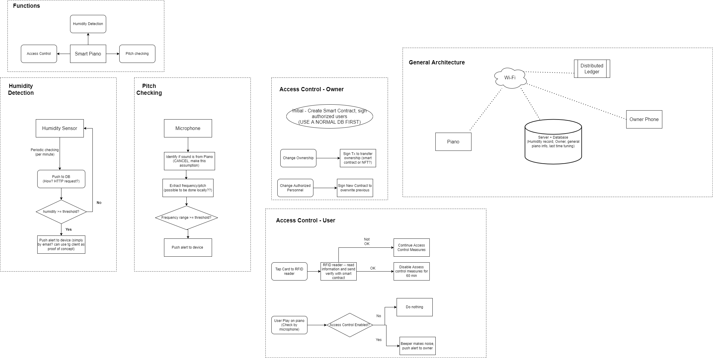

# smart-piano-ierg4230

This repo might be useful if we successfully get MAX4466.
https://github.com/adafruit/Adafruit_Learning_System_Guides/tree/main/Tiny_Music_Visualizer
https://learn.adafruit.com/piccolo   
https://blog.yavilevich.com/2016/08/arduino-sound-level-meter-and-spectrum-analyzer/    
😂😂😂   
If using heroku deployment   
https://towardsdatascience.com/deploy-a-micro-flask-application-into-heroku-with-postgresql-database-d95fd0c19408  

https://aliabdelaal.medium.com/telegram-bot-tutorial-using-python-and-flask-1fc634da9522    
 
https://medium.com/tech-insights/how-to-deploy-a-telegram-bot-with-flask-pytelegrambotapi-gunicorn-and-postgresql-to-heroku-19d87959a65   

https://ithelp.ithome.com.tw/articles/10227760   (Influxdb with grafana)

## Sensors to be used, and required functions on controller chip (ESP8266)
- MAX4466 Amplifier (Purchasing) -- Detect the frequency, send FFT spectrum to server. 
- MIC : Decide if have someone playing piano. If so, use the MAX4466.
- AHT10 Humidity -- Upload the humidity and temp info to server (temp info only for reference, no actual use for now). 
- Beeper -- Activate when receive signal from server. repeatedly play annoying sound when play piano without proper access control. Also play responsive sounds when users tap the RFID card.  
- OLED：Show welcome message or warning message as prompted.
- RFID: Tap cards to disable access control.  

## Hardware configuration 
We can use two ESP8266 boards. (Also separate project code into two boards).
No need direct communication between the two boards. Make use of the web server for all communications.
### Board 1 (Facing front to users)
Include only the OLED, RFID, beeper. (This part only do the access control.)  
Once users tap an RFID card ==> Send code to web server by REST API.   
Preset different response messages in the OLED 
Then upon receiving web request, show corresponding thing (message) immediately + make corresponding sound in beeper.   
(If cannot set up ESP8266 as web server externally, do periodic web reqeusts to server to active fetch info instead.)
### Board 2 (Install inside the piano)  
This include the MIC , MAX4466, AHT10.  
MIC - continuously monitor volume. ==> If volume exceeds threshold ==> code to activate MAX4466 detection ==> send FFT spectrum to server  
AHT10 ==> continuously monitor humidity ==> send data to server no matter what. 

## Backend Processing (Flask)
REST API (`base_url`: `34.150.76.100:9876`🙏🙏)
(TODO: require basic authentication??)  
### Humidity Collection
`GET /savehumidity` :  saves humidity into database + Check if need to send alert.  

**Parameters**:  

| Name | Type | Description | 
| --- | --- | --- | 
| humidity | float | Humidity value (%RH) | 

**Response:**  
200: OK  

### Access Record Update 
`POST /access` :  saves Access Record to Database + Check If it is an allowed user. (Then issue command to show corresponding text in OLED.)

**Parameters**:  

| Name | Type | Description | 
| --- | --- | --- | 
| id | string | UID of the RFID card (in ascii, length 8) | 

**Response:**  
200: OK  

### Audio Recording Update 
`POST /audio` :  receives recorded audio with FFT analysis for further processing. + No matter tuning or not, calling of this api means someone is using the computer, hence check access control.

**Parameters**:  

| Name | Type | Description | 
| --- | --- | --- | 
| data | TBD | TBD | 

**Response:**  
200: OK  

### Board 1 Command Update (Should be called by board 1 periodically)
`GET /command` :  returns a list of commands to be executed by the board in JSON format.  
**Parameters**: None

**Response:**  
200: JSON Response as follows:
- `"Status" : "OK" or "NOCMD"` (If received `NOCMD`, no need do anything)
- `Data`:
  - `Command` : 1 -> show Welcome message on OLED (access valid) + welcome sound on beeper,  2-> show warning message (access invalid) + warning sound , 3 -> show unauthorized access message + Annoying sound , 4 -> Show `[name] playing`, no sound   
  - `Name` : optional parmeter for command 4 only   
Example: `{"Status": "OK", "Data": {"Command": 1}}`  

## Frontend (Web) (Grafana)  
Access Endpoint : `34.150.76.100:3000`   
Required Functions:  
1. Show Access History from database
2. Show change in humidity over time
3. Show Tuning Reminders and history  
4. A metric to show how much different for frequency
5. show total usage time of piano

## Frontend (mobile) (Notifications only)
Use a telegram alert tool.  
Alert if:   
1.  Humidity exceeds threshold + Dehumidify tube not connected.
2.  All access records (different msg for valid or invalid access).
3.  Pitch is not right. 

Required user interactions:  
`/start` : add user to database   
`/register [cid]`: add allowed rfid card  
`/addtuning` : add tuning record  

## Flowchart

## Things not done (include in part 2 of the report)
1. Authorization / Transfer of ownership
2. Automatically link the humidity tube
